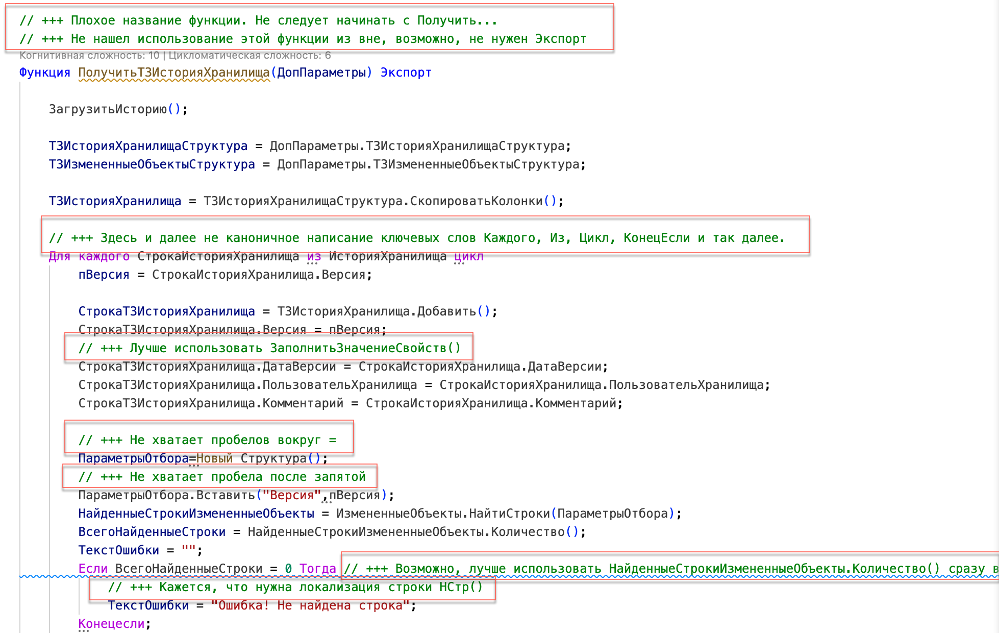
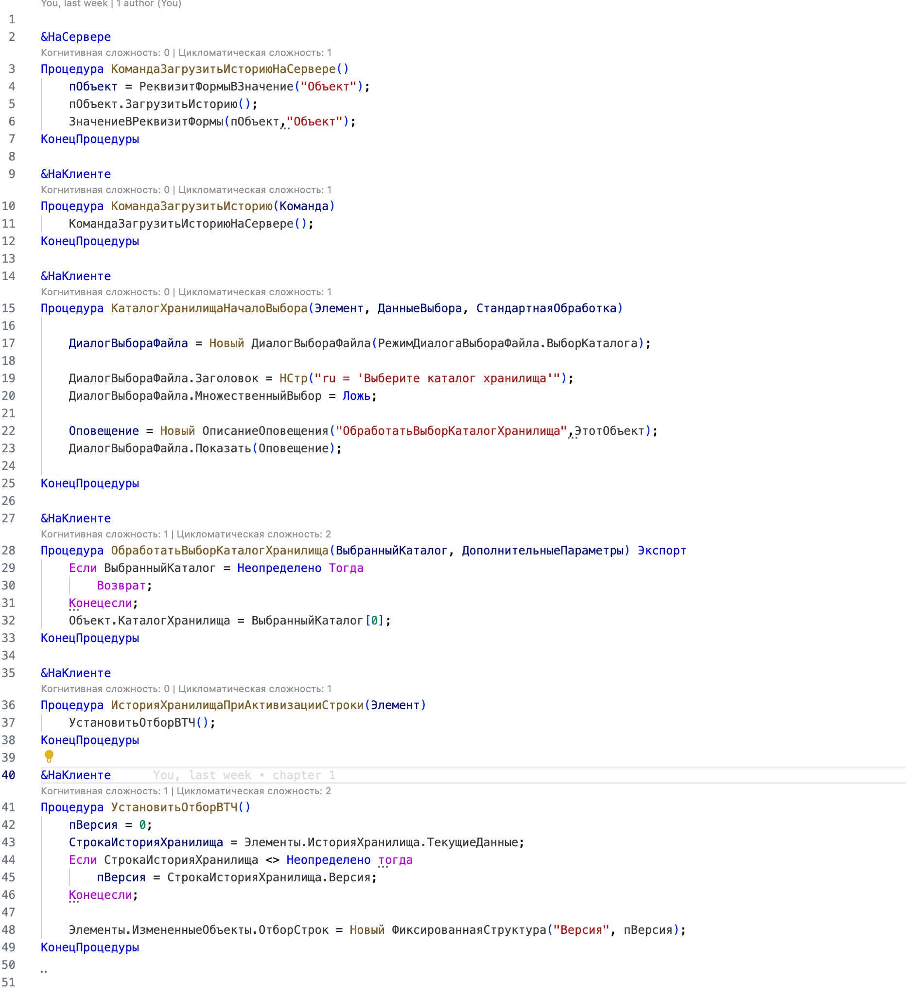
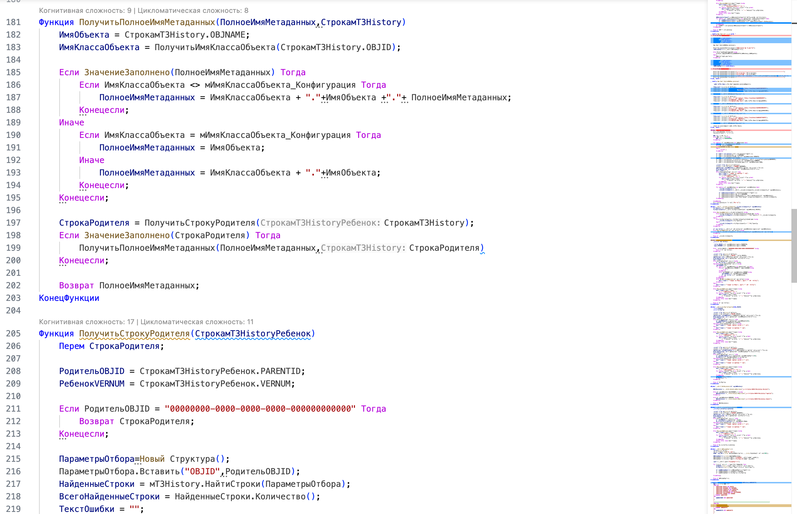
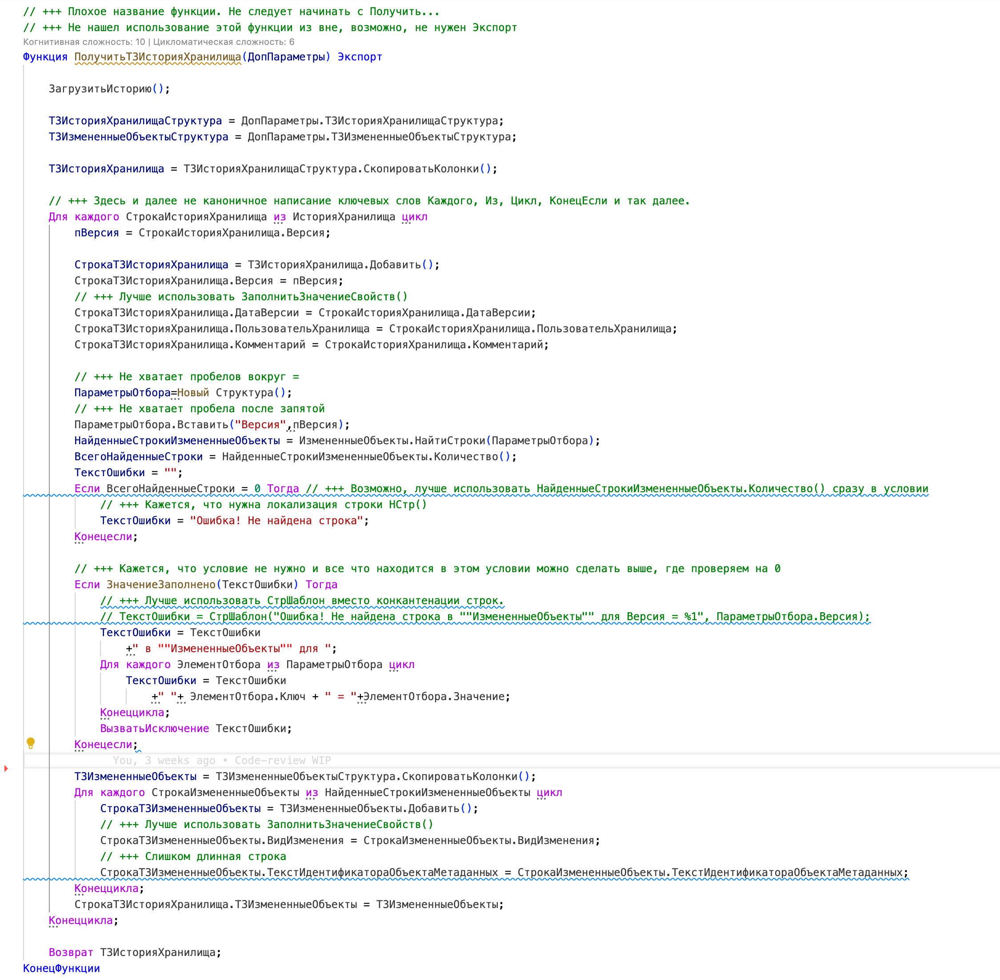
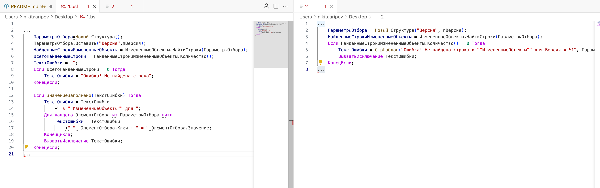

# Пример проведения код-ревью

## Результат

- Часть 1 - https://boosty.to/1cnik/posts/a0cfc52a-2471-47c2-8e7d-33a3a1d565d4
- Часть 2 - https://boosty.to/1cnik/posts/f54d95b4-45cb-44aa-aba3-a997e0972124
- Статья на  - https://infostart.ru/1c/2119477/

## Исходные данные

- Решение - <https://github.com/BlizD/HistoryStorage>
- Автор - <https://github.com/BlizD>

## Процесс работы

1. Выбираем что проверять. Судя по описанию, смотреть следует обработку **узПросмотрИсторииХранилища**
2. Начинаем с [Формы](https://github.com/BlizD/HistoryStorage/blob/master/src/cf/DataProcessors/узПросмотрИсторииХранилища/Forms/Форма/Ext/Form/Module.bsl)
3. Копируем файл формы в [Отдельный файл](src/form_raw.bsl)
4. Начинаем ревью кода в [Файле](form_review.bsl)
5. Сначала пробегаемся беглым взглядом, чтобы найти какие-то простые замечания и не отвлекаться потом на них
6. Следом проверяем уже детальнее, пытаясь понять что происходит в коде
7. Повторяем тоже самое с модулем объекта
8. Просматриваем свои замечания на предмет понятности
9. Готово! Теперь ждем когда исправят, чтобы сделать повторное ревью кода

## Черновик статьи для Инфостарт

**Тема:** Пример проведения Code-review

**Краткий анонс:**
В статье расскажу и покажу пример проводения Code-review на примере обработки с [GitHub - Просмотр истории хранилища](https://github.com/BlizD/HistoryStorage) от [Anton Ivanov](https://github.com/BlizD)

**Исходные данные:**

1. [Хранилище 1С. Просмотр истории хранилища обработкой](https://github.com/BlizD/HistoryStorage) от [Anton Ivanov](https://github.com/BlizD)
2. [Visual Studio Code](https://code.visualstudio.com)
3. [SonarQube 1C (BSL) Community Plugin](https://1c-syntax.github.io/sonar-bsl-plugin-community/)
4. [Система стандартов и методик разработки конфигураций 1С](https://its.1c.ru/db/v8std)

**Результат:**

1. К статье приложены файлы с результатами код-ревью. Замечания по коду отмечены // +++

2. Процесс проведения Code-review записал на видео и выложил на [Boosty](https://boosty.to/1cnik)

**Процесс работы и примеры замечаний:**

Code-review будем проводить в Visual Studio Code, так как у него есть подсветка синтаксиса и поддержка правил от сообщества. Плюс нам не потребуется запускать код, мы будем его только смотреть и пытаться понять что в нем происходит.

Обычно я провожу Code-review в два прохода:

1. Первый проход используется чтобы отсеять слишком явные замечания и в принципе бегло ознакомиться с чем имеем дело. В таком проходе обычно выявляются какие-то замечания к оформлению или явные нарушения стандартов. Замечания к логике или как можно сделать это проще не делается.

2. Второй проход уже смотрим внимательно, пытаясь понять что в этом коде происходит и все ли сделано понятно и оптимально. На этом этапе уже можно найти какие-то фундаментальные замечания, например, что не учтен какой-то случай или используется неправильный алгоритм. Этот этап более энергозатратный, поэтому если на первом этапе было много замечаний, то до второго этапа с первого раза может и не дойти.

В нашем примере начинаем проводить ревью начиная с формы, потому что там кода поменьше. В рамках примера мы рассматриваем только модули формы и модуля объекта, на сами формы не смотрим. Хотя в реальной жизни формы следует тоже смотреть. Сейчас готовлю отдельный [Гайд по создания форм на 1С](https://github.com/Oxotka/1CDesignGuide).

Вот так выглядит наш модуль формы:

В целом код выглядит нормально, явных претензий нет. В глаза сразу бросается отстуствие Областей. Пишем такое замечание "// +++ Стоит добавить области". Замечания в целом к модулю добавляю обычно вверху файла, чтобы сразу его было видно.

Также обращаем внимание на не каноническое написание ключевых слов, например "Конецесли" и "тогда". Следует писать "КонецЕсли" и "Тогда". Пишем также об этом замечание. Кажется, что достаточно написать это замечание в одном месте упомянув, что в других местах тоже следует поискать. Если что-то будет пропущено автором - не страшно, сможем указать на это при следующем раунде Code-review.
Замечание пишем так: "// +++ Здесь и далее не каноничное написание ключевых слов. См. КонецЕсли и Тогда"

На этом первый проход будет завершен, так как больше ничего не бросается в глаза.

Приступаем ко втором проходу. В принципе код простой и понятный и ничего особенного не замечаю. Хотя вот этот момент может быть интересен:

Процедура УстановитьОтборВТЧ()
	пВерсия = 0;
	СтрокаИсторияХранилища = Элементы.ИсторияХранилища.ТекущиеДанные;	
	Если СтрокаИсторияХранилища <> Неопределено тогда
		пВерсия = СтрокаИсторияХранилища.Версия;	
	Конецесли;	
	
	Элементы.ИзмененныеОбъекты.ОтборСтрок = Новый ФиксированнаяСтруктура("Версия", пВерсия);
КонецПроцедуры 

Судя по коду у нас может быть ситуация, когда ничего не выбрано. Возможно, в этом случае либо показывать весь список, либо пустой и подсказку. Давайте это и напишем.

Процедура УстановитьОтборВТЧ()
	пВерсия = 0;
	СтрокаИсторияХранилища = Элементы.ИсторияХранилища.ТекущиеДанные;	
	Если СтрокаИсторияХранилища <> Неопределено тогда
		пВерсия = СтрокаИсторияХранилища.Версия;	
	Конецесли;	
	
	// +++ Возможно, когда ничего не выбрано, стоит показывать весь список без отбора, а не по 0 версии.
	Элементы.ИзмененныеОбъекты.ОтборСтрок = Новый ФиксированнаяСтруктура("Версия", пВерсия);
КонецПроцедуры 

В остальном код, кажется, понятным и можно приступать к модулю объекта обработки.

Приступаем к модулю объекта:

Опять также делаем первый проход с замечаниями, которые бросаются в глаза, например:

1. Не каноничное написание ключевых слов
2. Использование конкантенации вместо СтраШаблон
3. Экономия на пробелах, например. не ставим их вокругл = или ,.
4. Слишком длинные строки
5. Не используем ЗаполнитьЗначениеСвойств и так далее.

Примеры таких замечаний:

Приступаем ко второму проходу, вникая в то, что делает код в каждой процедуре. Подробные размышления можно увидеть в ролике на Boosty, или посмотреть результат в файлах.
Здесь приведу лишь один пример размышления и замечаний для упрощения функции. Увидел частое использование повторяющегося кода вот такого вида:

        ПараметрыОтбора=Новый Структура();
		ПараметрыОтбора.Вставить("Версия",пВерсия);
		НайденныеСтрокиИзмененныеОбъекты = ИзмененныеОбъекты.НайтиСтроки(ПараметрыОтбора);
		ВсегоНайденныеСтроки = НайденныеСтрокиИзмененныеОбъекты.Количество();
		ТекстОшибки = "";
		Если ВсегоНайденныеСтроки = 0 Тогда
			ТекстОшибки = "Ошибка! Не найдена строка";
		Конецесли;
		
		Если ЗначениеЗаполнено(ТекстОшибки) Тогда
			ТекстОшибки = ТекстОшибки  
				+" в ""ИзмененныеОбъекты"" для ";
			Для каждого ЭлементОтбора из ПараметрыОтбора цикл
				ТекстОшибки = ТекстОшибки  
					+" "+ ЭлементОтбора.Ключ + " = "+ЭлементОтбора.Значение;				
			Конеццикла;
			ВызватьИсключение ТекстОшибки;	
		Конецесли;

В этой части кода мы пытаемся найти строки таблицы по структуре и если ничего не нашли, то выводим исключение.
Код, кажется, можно упростить для понимания.
Например, мы видим, что есть отдельное условие когда у нас есть ошибка. Но это возможно, только если выполняется условие выше, когда ВсегоНайденныеСтроки = 0. То есть мы можем избавиться от второго условия объединив их. Например, вот так:

        ПараметрыОтбора=Новый Структура();
		ПараметрыОтбора.Вставить("Версия",пВерсия);
		НайденныеСтрокиИзмененныеОбъекты = ИзмененныеОбъекты.НайтиСтроки(ПараметрыОтбора);
		ВсегоНайденныеСтроки = НайденныеСтрокиИзмененныеОбъекты.Количество();
		ТекстОшибки = "";
		Если ВсегоНайденныеСтроки = 0 Тогда
			ТекстОшибки = "Ошибка! Не найдена строка";
			ТекстОшибки = ТекстОшибки  
				+" в ""ИзмененныеОбъекты"" для ";
			Для каждого ЭлементОтбора из ПараметрыОтбора цикл
				ТекстОшибки = ТекстОшибки  
					+" "+ ЭлементОтбора.Ключ + " = "+ЭлементОтбора.Значение;				
			Конеццикла;
			ВызватьИсключение ТекстОшибки;	
		Конецесли;

Смотрим на код еще раз и видим, что переменная ТекстОшибки у нас составляется из разных частей, с помощью конкантенации. Кажется, что можно использовать для этого СтрШаблон. Причем цикл для перебора параметров отбора, кажется, излишним, так как мы сами вверху создали структуру всего с одним свойством. Кажется, что можно также явно указывать это свойство структуры. То есть код может выглядеть вот так:
        ПараметрыОтбора=Новый Структура();
		ПараметрыОтбора.Вставить("Версия",пВерсия);
		НайденныеСтрокиИзмененныеОбъекты = ИзмененныеОбъекты.НайтиСтроки(ПараметрыОтбора);
		ВсегоНайденныеСтроки = НайденныеСтрокиИзмененныеОбъекты.Количество();
		ТекстОшибки = "";
		Если ВсегоНайденныеСтроки = 0 Тогда
			ТекстОшибки = СтрШаблон("Ошибка! Не найдена строка в ""ИзмененныеОбъекты"" для Версия = %1", ПараметрыОтбора.Версия);
			ВызватьИсключение ТекстОшибки;	
		Конецесли;

Что еще здесь можно сделать проще? Кажется, стоит отказаться от инициализации переменных - ВсегоНайденныеСтроки и ТекстОшибки:

        ПараметрыОтбора=Новый Структура();
		ПараметрыОтбора.Вставить("Версия",пВерсия);
		НайденныеСтрокиИзмененныеОбъекты = ИзмененныеОбъекты.НайтиСтроки(ПараметрыОтбора);
		Если НайденныеСтрокиИзмененныеОбъекты.Количество() = 0 Тогда
			ТекстОшибки = СтрШаблон("Ошибка! Не найдена строка в ""ИзмененныеОбъекты"" для Версия = %1", ПараметрыОтбора.Версия);
			ВызватьИсключение ТекстОшибки;	
		Конецесли;

Ну и для еще упрощения сразу инициализируем структуру и приведем код к каноничному виду.

        ПараметрыОтбора = Новый Структура("Версия", пВерсия);
		НайденныеСтрокиИзмененныеОбъекты = ИзмененныеОбъекты.НайтиСтроки(ПараметрыОтбора);
		Если НайденныеСтрокиИзмененныеОбъекты.Количество() = 0 Тогда
			ТекстОшибки = СтрШаблон("Ошибка! Не найдена строка в ""ИзмененныеОбъекты"" для Версия = %1", ПараметрыОтбора.Версия);
			ВызватьИсключение ТекстОшибки;
		КонецЕсли;

Итого вот сравнение двух частей кода, которые делают одно и то же:

Подобным образом смотрим на остальной код, пытаясь понять что в нем делается и как это можно сделать проще. Записываем подобные замечания в файлик.
Результат такого расследования можно посмотреть в приложенных файлах.

**Итоги**

Полный результат ревью и все замечания можно посмотреть в приложенных к статье файлах. Все замечания добавлены комментарием // +++, можно сразу по ним поискать в коде.

Результаты ревью направлены разработчику, кстати не забудьте поставить звездочку обработке Хранилище 1С. Просмотр истории хранилища обработкой от Anton Ivanov.

Обычно после первого раунда Code-review разработчик исправляет замечания и присылает на повторное ревью и так до тех пор, пока ревьюер не примет код. Кстати, ревьюер затем также и делит ответственность за этот код с разработчиком. В случае если будет какая-то проблема, то будут вопросы и как допустили, и почему не нашли при ревью и тестировании. Поэтому важно делать ревью осознано.

В ближайшее время планирую добавить новые ролики на Boosty с разбором кода. Подписывайтесь :)

**Полезные ссылки**

1. Стек технологий для 1С
2. Инструменты и процессы разработки 1С:Бухгалтерии
3. Шаблоны новых объектов для 1С:Бухгалтерии
4. Мой Boosty 
5. Мой Телеграм
