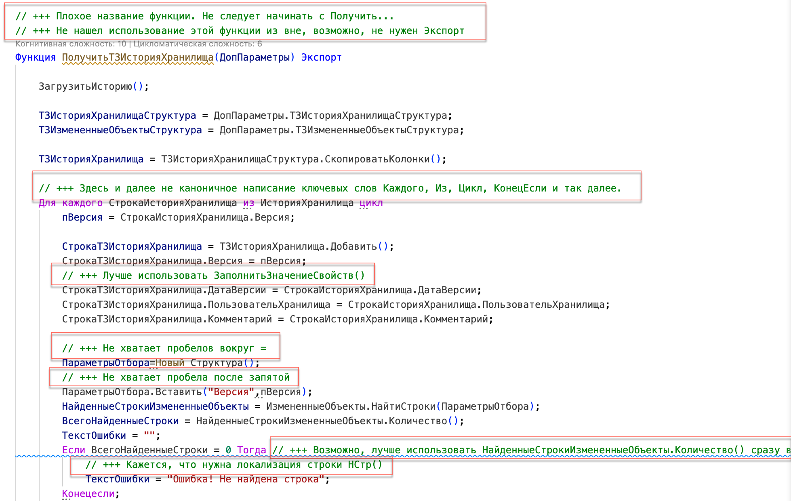
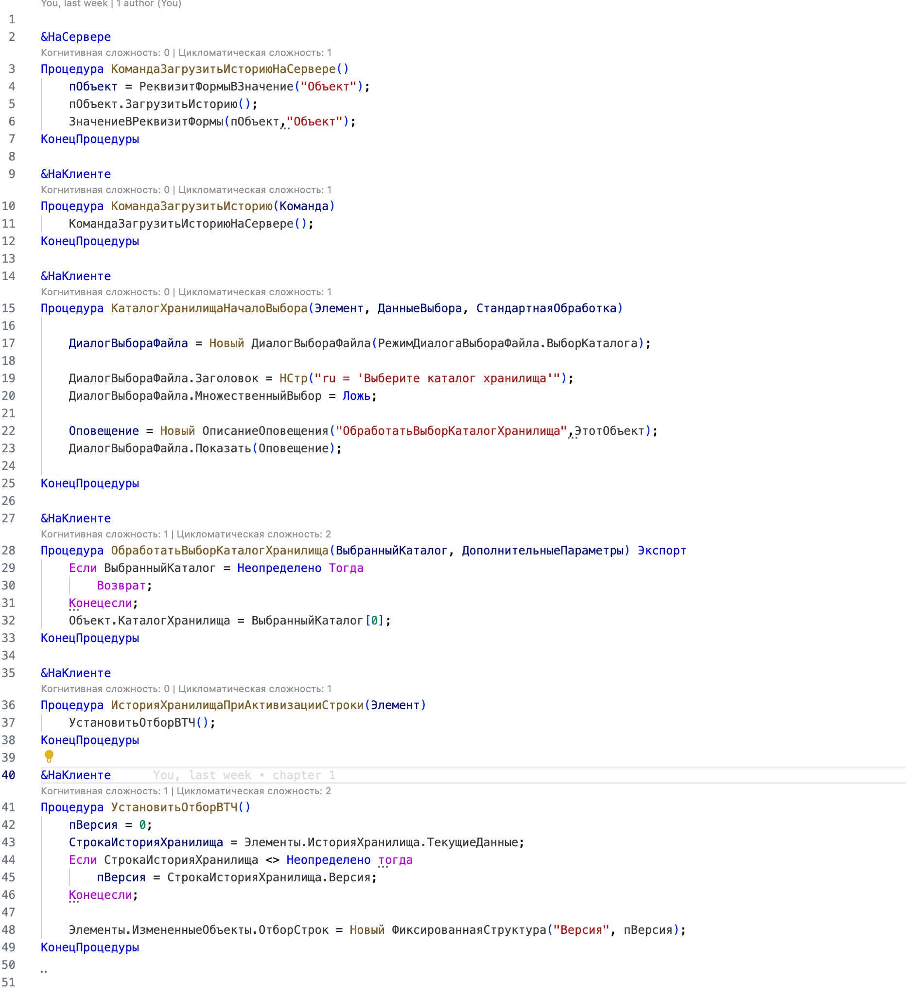

# Пример проведения код-ревью

## Результат

- Часть 1 - https://boosty.to/1cnik/posts/a0cfc52a-2471-47c2-8e7d-33a3a1d565d4
- Часть 2 - https://boosty.to/1cnik/posts/f54d95b4-45cb-44aa-aba3-a997e0972124

## Исходные данные

- Решение - <https://github.com/BlizD/HistoryStorage>
- Автор - <https://github.com/BlizD>

## Процесс работы

1. Выбираем что проверять. Судя по описанию, смотреть следует обработку **узПросмотрИсторииХранилища**
2. Начинаем с [Формы](https://github.com/BlizD/HistoryStorage/blob/master/src/cf/DataProcessors/узПросмотрИсторииХранилища/Forms/Форма/Ext/Form/Module.bsl)
3. Копируем файл формы в [Отдельный файл](src/form_raw.bsl)
4. Начинаем ревью кода в [Файле](form_review.bsl)
5. Сначала пробегаемся беглым взглядом, чтобы найти какие-то простые замечания и не отвлекаться потом на них
6. Следом проверяем уже детальнее, пытаясь понять что происходит в коде
7. Повторяем тоже самое с модулем объекта
8. Просматриваем свои замечания на предмет понятности
9. Готово! Теперь ждем когда исправят, чтобы сделать повторное ревью кода

## Статья для Инфостарт

**Тема:** Пример проведения Code-review

**Краткий анонс:**
В статье расскажу и покажу пример проводения Code-review на примере обработки с GitHub - Просмотр истории хранилища

**Исходные данные:**

1. [Хранилище 1С. Просмотр истории хранилища обработкой](https://github.com/BlizD/HistoryStorage)
2. [Visual Studio Code](https://code.visualstudio.com)
3. [SonarQube 1C (BSL) Community Plugin](https://1c-syntax.github.io/sonar-bsl-plugin-community/)
4. [Система стандартов и методик разработки конфигураций 1С](https://its.1c.ru/db/v8std)

**Результат:**

1. К статье приложены файлы с результатами код-ревью. Замечания по коду отмечены // +++

2. Процесс проведения Code-review записал на видео и выложил на [Boosty](https://boosty.to/1cnik)

**Процесс работы и примеры замечаний:**

Code-review будем проводить в Visual Studio Code, так как у него есть подсветка синтаксиса и поддержка правил от сообщества. Плюс нам не потребуется запускать код, мы будем его только смотреть и пытаться понять что в нем происходит.

Обычно я провожу Code-review в два прохода:

1. Первый проход используется чтобы отсеять слишком явные замечания и в принципе бегло ознакомиться с чем имеем дело. В таком проходе обычно выявляются какие-то замечания к оформлению или явные нарушения стандартов. Замечания к логике или как можно сделать это проще не делается.

2. Второй проход уже смотрим внимательно, пытаясь понять что в этом коде происходит и все ли сделано понятно и оптимально. На этом этапе уже можно найти какие-то фундаментальные замечания, например, что не учтен какой-то случай или используется неправильный алгоритм. Этот этап более энергозатратный, поэтому если на первом этапе было много замечаний, то до второго этапа с первого раза может и не дойти.

В нашем примере начинаем проводить ревью начиная с формы, потому что там кода поменьше. В рамках примера мы рассматриваем только модули формы и модуля объекта, на сами формы не смотрим. Хотя в реальной жизни формы следует тоже смотреть. Сейчас готовлю отдельный [Гайд по создания форм на 1С](https://github.com/Oxotka/1CDesignGuide).

Вот так выглядит наш модуль формы:

В целом код выглядит нормально, явных претензий нет. В глаза сразу бросается отстуствие Областей. Пишем такое замечание "// +++ Стоит добавить области". Замечания в целом к модулю добавляю обычно вверху файла, чтобы сразу его было видно.

Также обращаем внимание на не каноническое написание ключевых слов, например "Конецесли" и "тогда". Следует писать "КонецЕсли" и "Тогда". Пишем также об этом замечание. Кажется, что достаточно написать это замечание в одном месте упомянув, что в других местах тоже следует поискать. Если что-то будет пропущено автором - не страшно, сможем указать на это при следующем раунде Code-review.
Замечание пишем так: "// +++ Здесь и далее не каноничное написание ключевых слов. См. КонецЕсли и Тогда"

На этом первый проход будет завершен, так как больше ничего не бросается в глаза.

Приступаем ко втором проходу:
